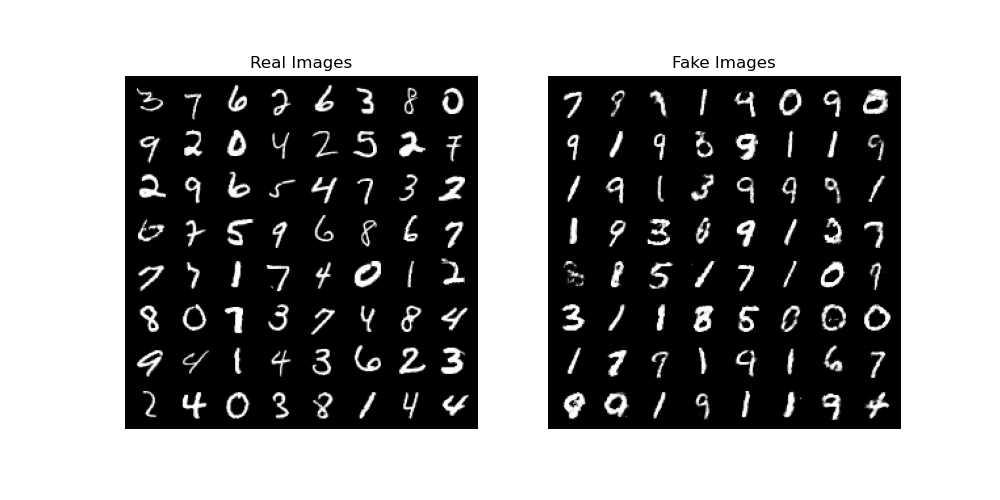

# Generative Adversarial Network (GAN)
한국어 버전의 설명은 [여기](./docs/README_ko.md)를 참고하시기 바랍니다.

## Introduction
A Generative Adversarial Network (GAN) is a generative model aimed at creating new data.
It emerged after the variational autoencoder (VAE) and is currently one of the most studied and utilized algorithms for data generation. This code provides a vanilla GAN implementation, and for the MNIST dataset, it visualizes the sequential changes in the generated results as the GAN trains, in a gif format.
Additionally, to evaluate the quality of the data generated by the trained model, you can calculate the [Fréchet Inception Distance (FID) score](https://github.com/mseitzer/pytorch-fid).
For more information on GANs, please refer to the [Generative Adversarial Network (GAN)](https://ljm565.github.io/contents/GAN1.html).
<br><br><br>

## Supported Models
### Vanilla GAN
A vanilla GAN using `nn.Linear` is implemented.
<br><br><br>

## Base Dataset
* Base dataset for tutorial is [MNIST](http://yann.lecun.com/exdb/mnist/).
* Custom datasets can also be used by setting the path in the `config/config.yaml`.
However, implementing a custom dataloader may require additional coding work in `src/utils/data_utils.py`.
<br><br><br>


## Quick Start
```bash
python3 src/run/train.py --config config/config.yaml --mode train
```
<br><br>


## Project Tree
This repository is structured as follows.
```
├── configs                         <- Folder for storing config files
│   └── *.yaml
│
└── src      
    ├── models
    |   └── gan.py                  <- GAN model file
    |
    ├── run                   
    |   ├── cal_fid.py              <- Codes for calculating FID score
    |   ├── train.py                <- Training execution file
    |   └── validation.py           <- Trained model evaulation execution file
    | 
    ├── tools    
    |   ├── pytorch_fid             <- Codes for calculating FID score
    |   |   ├── fid_score.py
    |   |   └── inception.py
    |   |
    |   ├── model_manager.py          
    |   └── training_logger.py      <- Training logger class file
    |
    ├── trainer                 
    |   ├── build.py                <- Codes for initializing dataset, dataloader, etc.
    |   └── trainer.py              <- Class for training, evaluating, and visualizing with t-SNE
    |
    └── uitls                   
        ├── __init__.py             <- Class for training, evaluating, and FID calculation
        ├── data_utils.py           <- File defining the custom dataset dataloader
        ├── filesys_utils.py       
        └── training_utils.py     
```
<br><br>

## Tutorials & Documentations
Please follow the steps below to train the GAN.
1. [Getting Started](./docs/1_getting_started.md)
2. [Data Preparation](./docs/2_data_preparation.md)
3. [Training](./docs/3_trainig.md)
4. ETC
   * [Evaluation](./docs/4_model_evaluation.md)
   * [FID Calculation](./docs/5_calculate_fid.md)

<br><br><br>


## Training Results
* Results of GAN<br><br>
<br><br>
<br><br>
<br><br><br>

